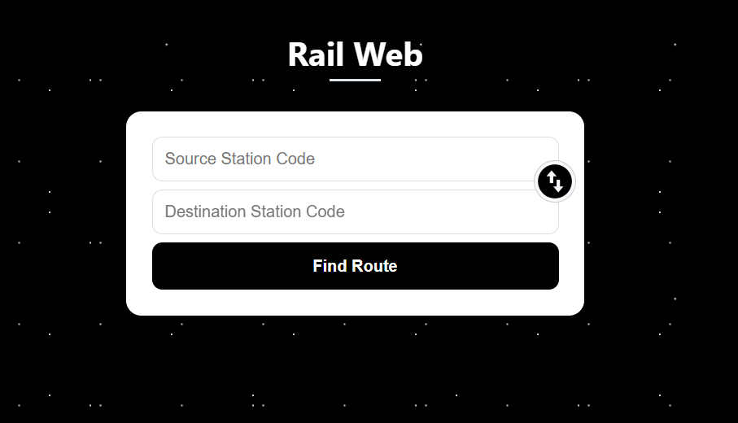
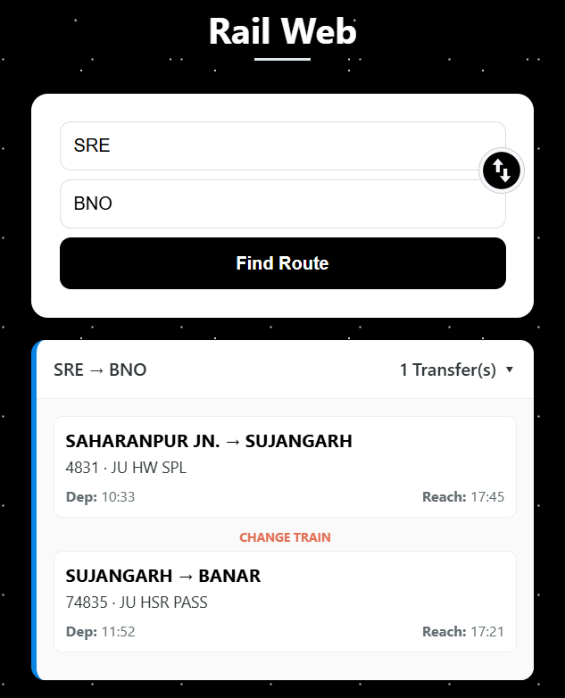

# 🎯 RailWeb – Railway Route Planner Backend API

**RailWeb** is a lightweight, clean backend API for **Indian railway route planning**.  
It focuses on **fast, precise route suggestions** and a smooth integration experience for apps and tools — without clutter, ads, or unnecessary complexity.

---

## 🎯 The Mission

Most railway route planners are either:
- bloated websites,  
- confusing apps, or  
- closed‑source services.

**RailWeb** is built to do **one job well**:
- Let users find **all possible routes** between any two Indian railway stations  
- With **valid train numbers, classes, and transfer recommendations**  
- While feeling **simple, developer‑friendly, and reliable**.

It is designed as a **learning‑focused, ethical, and open tool** for creators and hobbyists.

---

## 🚀 Features

🚉 **Multi‑Route Suggestions** – Discover all possible station‑to‑station routes  
📘 **Train‑Level Details** – Train numbers, Names  
🔁 **Smart Transfer Logic** – Suggests realistic transfer points between trains  

🎨 **Developer‑Friendly JSON API**  
- Clean, consistent JSON responses  
- Simple HTTP requests from any app or frontend  
- Easy to integrate in Unity, React, Android, etc.

🧼 **Clean & Minimal Structure**  

RailWeb also comes with a **clean, responsive web frontend** built with:

- **HTML**  
- **CSS**  
- **JavaScript**

This frontend:
- Connects to the RailWeb API (`/find-route`)  
- Shows routes, stations, and key details  
- Provides a **user‑friendly interface** while using the same backend logic

You can:
- Run the backend with `python app.py`  
- Open `index.html` or the frontend folder in your browser  
- See the full experience: **API‑powered route planner with a polished UI**

🧠 **Offline‑First Design**  
- Uses local text files for station and route data  
- No heavy external APIs required  
- Fast, local calculations  

🧼 **Clean & Minimal Structure**  
- No ads, no crapware  
- Single `app.py` Flask backend  
- Simple `algorithm.py` for core logic  

And much more under the hood.

## 📸 Screenshots

| View | Description |
|------|-------------|
|  | Main window with input fields |
|  | Response/Routes |

---

## 🛠 Tech Stack

- **Language:** Python
- **Frontend:** HTML, CSS, JS   
- **Backend:** Flask  
- **API Style:** RESTful JSON  
- **Data Format:** Plain text files (`stations.txt`, `routes.txt`)  
- **Dev Tools:** Postman (testing), Unity (client‑side integration)

---

## ⚙️ Local Setup

```bash
git clone https://github.com/mshezikhan/railweb.git
cd railweb
python -m venv venv
venv\Scripts\activate     # on Windows
pip install -r requirements.txt
python app.py
```

The API will launch at:  
`http://127.0.0.1:5000`

Example API call:

```bash
curl -X POST http://127.0.0.1:5000/find-route \
  -H "Content-Type: application/json" \
  -d '{"source": "SRE", "destination": "DDN"}'
```

---

## 👥 Contributing

1. Fork the repository  
2. Create your feature branch: `git checkout -b feature-name`  
3. Commit your changes  
4. Push to your branch  
5. Open a Pull Request 🚀  

We welcome:
- new route‑logic improvements  
- better JSON formatting  
- better docs or README examples  

---

## 📄 License

[MIT License](LICENSE)

---

Made with ❤️ by **Shezi Khan**
